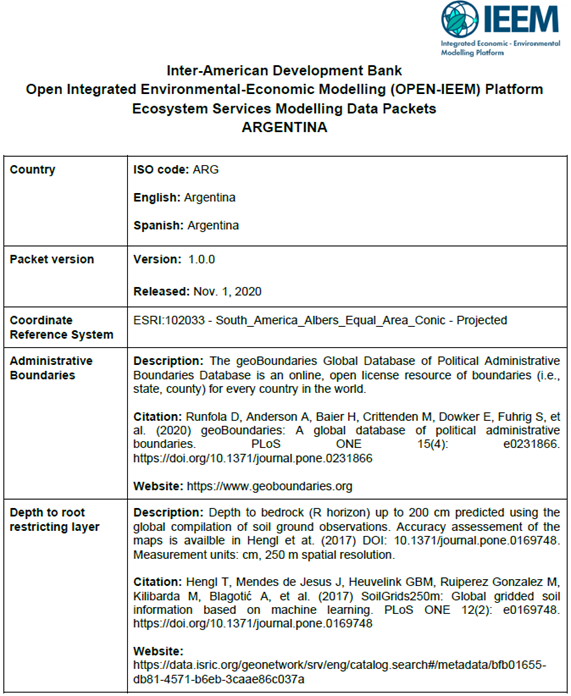

# ARGENTINA

**Inter-American Development Bank**

**OPEN Integrated Economic-Environmental Modeling (OPEN IEEM) Platform**

**The Integrated Economic-Environmental Modeling Platform + Ecosystem Services Modeling (IEEM+ESM) data packet: Overview and guidelines for use**

| **Description**                      | **Links** |
| :--- | :---: |
| Ecosystem Service Modeling Data \(Zipped folder\)      | [ **Download** ](https://github.com/Open-IEEM/IEEM-ES-ARG/archive/main.zip) |
| Country Data Sheet                   | [ **Download** ](https://github.com/Open-IEEM/IEEM-ES-ARG/raw/main/ARG%20DATA%20SHEET.pdf) |
| This README                          | [ **Download** ](https://github.com/Open-IEEM/IEEM-ES-ARG/raw/main/README.pdf) |

## 1. Overview

The Integrated Economic-Environmental Modeling platform (IEEM, Banerjee
et al. 2016, 2019, 2020a) is designed to better integrate macroeconomic
data and models with environmental data in order to more holistically
assess the linked environmental-economic consequences of development
decisions. With the recent coupling of IEEM to ecosystem service models
(IEEM+ESM, Banerjee et al. 2020a,c), the platform can be used to produce
policy-driven land-use/land-cover (LULC) change, which feeds into
ecosystem service model results, which can subsequently inform
subsequent macroeconomic trends through positive or negative economic
shocks. Doing so requires the coupling of IEEM, which is at its core an
economy-wide dynamic computable general equilibrium model (Banerjee and
Cicowiez 2020, Banerjee et al. 2020b), with LULC change and ecosystem
service models that make heavy use of geospatial data and biophysical
lookup tables – data sources that differ from those used in traditional
economic analysis.

Integrated Valuation of Ecosystem Services and Tradeoffs (InVEST, Sharp
et al. 2020) is one of the most widely used ecosystem service modeling
tools (Posner et al. 2016). However, one of its primary limitations is
the time and expertise required to assemble the best-available spatial
data and biophysical lookup tables for its use. Doing so can take many
months, which can be incompatible with decision-making timelines that
would benefit from ecosystem services information, including integrated
economic-environmental analysis such as those undertaken with IEEM+ESM.
We have assembled a series of national data packets for InVEST that
provide the spatial data and lookup tables needed to run the InVEST
carbon storage, annual water yield, sediment delivery ratio, and
nutrient delivery ratio models for 21 countries in Latin America and the
Caribbean region.

These data packets are essentially “plug and play” in that all data are
pre-processed and ready to be implemented with these four InVEST models.
This document describes the content and appropriate reuse of these data
packets; country-specific descriptors about the spatial datasets are
provided with each country’s packet. Below we describe the organization
and contents of the data packets (Section 2), use notes for the four
models (Section 3), the alignment of land cover data for use in lookup
tables (Section 4), the customization of lookup table parameters
(Section 5), and caveats and appropriate reuse of the data packets
(Section 6). While the data packets were initially developed to directly
support IEEM, they can also be used as a starting point for other types
of ecosystem service assessments in the region, as well as serve as a
template for the development of data packets for other regions of the
world or for other ecosystem service models.

## 2. Organization of the data packets

Each country’s data packet can be downloaded as a zipped folder from the
IEEM website, with countries labeled by their 3-digit ISO code. Each
folder contains subdirectories with datasets needed to run the four
InVEST models (Figure 1). Each folder also contains a data descriptor
sheet that describes the specific data sources in each country’s packet
(Figure 2). In addition, the data descriptor sheet includes a table
showing the data needs of each of the four InVEST models (Table 1).

**Figure 1.** Contents of each country’s data packet.

**Figure 2.** Sample data descriptor sheet for Argentina.

**Table 1.** Data needs for each of the four InVEST models (also
contained within each data descriptor sheet). For additional data needs,
see Sharp et al. (2020).

| **Dataset**                     | **Carbon storage** | **Annual water yield** | **Nutrient delivery ratio** | **Sediment delivery ratio** |
|---------------------------------|--------------------|------------------------|-----------------------------|-----------------------------|
| Land use-land cover             | X                  | X                      | X                           | X                           |
| Depth to root restricting layer |                    | X                      |                             |                             |
| Elevation                       |                    |                        | X                           | X                           |
| Reference evapotranspiration    |                    | X                      |                             |                             |
| Plant available water content   |                    | X                      |                             |                             |
| Annual precipitation            |                    | X                      | X                           |                             |
| K factor (soil erodibility)     |                    |                        |                             | X                           |
| R factor (rainfall erosivity)   |                    |                        |                             | X                           |
| Soil carbon storage             | X                  |                        |                             |                             |
| Watersheds & subwatersheds      |                    | X                      | X                           | X                           |

Data in each country’s packet includes:

1.  **Administrative boundaries**: National and 1st-level
    administrative boundaries (i.e., departments, provinces, or states),
    which can be used to geographically summarize model outputs.

2.  **Annual precipitation:** Average annual precipitation in mm/year, used
    in the annual water yield and nutrient delivery ratio models.

3. **Depth to root restricting layer:** Depth to bedrock in mm, up to a
    maximum value of 2000 mm, used in the annual water yield model.

4.  **Elevation:** A digital elevation model measuring elevation above sea
    level in meters, used in the nutrient and sediment delivery ratio
    models.

5.  **K factor (soil erodibility):** The susceptibility of soil to
    water-based erosion, used in the sediment delivery ratio model.

6.  **LULC\_CCI:** Global land cover data, used by all four models.

7.  **LULC\_country:** National land cover data, used by all four models in
    countries with national land cover datasets (i.e., not available in
    all countries).

8.  **Model lookup tables:** Lookup tables that associate land cover classes
    with physical parameter estimates needed to run each of the four
    models.

9.  **Plant available water content:** the quantity of water stored in the
    soil that can be used by plants, used in the annual water yield
    model.

10. **R factor (rainfall erosivity):** A measure of the erosive force of
    rainfall, used in the sediment delivery ratio model.

11. **Reference evapotranspiration:** Average annual potential
    evapotranspiration in mm/year, used in the annual water yield model.

12. **Soil carbon storage:** The mass of soil carbon (in T/ha), which can be
    added to vegetation carbon storage model outputs to estimate total
    carbon storage.

13. **Watersheds:** Watershed and subwatershed boundaries, used in the
    annual water yield, nutrient, and sediment delivery ratio models.

## 3. InVEST model-specific notes

For full descriptions of each model, please consult the InVEST user’s
guide (Sharp et al. 2020). InVEST models typically require a *lookup
table* that associates land cover classes with physical parameter
estimates needed to run the model (i.e., pairing each land cover type
with one or more physical estimates, Sharp et al. 2020; Table 2). In our
data packet, tables ending in “\_cci.csv” are designed to be run with
European Space Agency Climate Change Initiative (CCI) global land cover
data. Tables ending in “\_national.csv” are designed to run with the
appropriate nationally sourced dataset. Running a model using global
land cover spatial data with a national lookup table, or vice versa,
will cause a model run to fail.

**Table 2.** Partial example annual water yield lookup table. For column
heading definitions, see Sharp et al. (2020).

| lucode | LULC\_desc                           | LULC\_veg | root\_depth | Kc    |
|--------|--------------------------------------|-----------|-------------|-------|
| 10     | NonIrrgatedArableLand                | 1         | 1000        | 0.65  |
| 11     | NonIrrgatedArableLandHerbaceous      | 1         | 1500        | 0.575 |
| 12     | PermanentCropland                    | 1         | 2250        | 0.825 |
| 20     | PermanentlyIrrigatedArableLan        | 1         | 1000        | 0.65  |
| 30     | ComplexCultivationPatternedLand      | 1         | 1833        | 0.675 |
| 40     | AgriculturalLandWithNativeVegetation | 1         | 2667        | 0.7   |
| 50     | EvergreenBroadleafForest             | 1         | 3500        | 1     |
| 60     | DeciduousBroadleafForest             | 1         | 3500        | 1     |
| 61     | ClosedDeciduousBroadleafForest       | 1         | 3500        | 1     |
| 62     | OpenDeciduousBroadleafForest         | 1         | 3500        | 1     |
| 70     | EvergreenConiferousForest            | 1         | 3500        | 1     |

***Carbon storage and sequestration model***. InVEST’s lookup table for
carbon requires the quantification of carbon storage in four carbon
pools for each land cover type: above-ground biomass (shoots and
leaves), below-ground biomass (roots), soil, and dead woody debris. As
no appropriate global lookup table for carbon storage exists, we adapted
the IPCC Tier 1 global study from Ruesch and Gibbs (2008) for use in
InVEST. This study uses a multilayer lookup table, with land cover,
continent, ecofloristic region, frontier forests (those with minimal
fragmentation or human disturbance, Convention on Biological Diversity
2020), and burned forests used to predict total vegetation carbon
storage (above-ground, below-ground, and dead biomass). It does not
quantify soil carbon storage.

A major benefit of the Ruesch and Gibbs study is that it better
distinguishes carbon storage levels in different *ecosystems* that may
have the same land cover but varying carbon storage. For example, a
global lookup table that matches land cover to carbon storage values
would assign the same values to broadleaf forests found in African
tropical rainforests, Amazonian tropical rainforests, and temperate
forests; it would also be unable to account for undisturbed primary
forests (i.e., frontier forests) that are less disturbed and typically
have greater carbon storage. To account for these differences, we
provide a different lookup table for each country based on the continent
and the distribution of forests, savannas, shrublands, wetlands, and
mixed agriculture/natural vegetation within the different ecoregions for
that country, and accounting for the area of frontier forests in the
country.

We calculated this by overlaying Ruesch and Gibbs’ ecoregions data and
the 2016 Intact Forest Landscapes dataset (Intact Forest Landscapes
2020) with year 2015 CCI forest cover data, and estimating the
percentage of each of the above land cover types by ecoregion, frontier
forest classification, and country. We then weighted carbon storage
appropriately for that country by each land cover type present in the
country. This method accounts for continent, ecofloristic region, and
frontier forests in Ruesch and Gibbs’ lookup table. On a grid cell
basis, our results will be somewhat homogenized since our methods
calculate weighted average values by forest type, rather than
calculating results for each cell using a multilayer lookup table.
However, they should be accurate at the country level. We also assume
that forests are unburned, somewhat overestimating their carbon stocks.
We placed our estimated vegetation carbon value in the “c\_above” column
of the lookup table but recognize that this value actually represents
the sum of above-ground biomass, below-ground biomass, and dead carbon
biomass, excluding soil carbon. In all cases, these values can be
replaced by national-scale carbon storage estimates from national forest
or carbon inventories where such data are available.[1](#footnote1)

Since Ruesch and Gibbs do not account for soil carbon storage, we
provide raster data for soil carbon storage from ISRIC’s SoilGrids 250m
(Hengl et al. 2017) in the data packet. These data can be combined with
modeled vegetation carbon storage results to estimate total carbon
storage by the ecosystem by simply summing results of the InVEST carbon
model (which accounts for above-ground, below-ground, and dead biomass)
with SoilGrids soil carbon storage data using a raster calculator tool
within GIS software.

***Annual water yield model***. Parameters for root depth and
evapotranspiration coefficient (Kc) are derived from Roxburgh et al.’s
(2020) global InVEST study, who developed their values from a global
literature review of previous InVEST studies. These can be replaced with
nationally appropriate values from past InVEST studies where available,
based on expert judgment. We generated plant available water content
data using methods from Elnesr (2006) and global soils data (Hengl et
al. 2017).

In the absence of data and expertise required for model calibration, we
suggest following recommendations from Sharp et al. (2020) for the Z
parameter. The Z parameter typically ranges from 1 to 30 and can most
easily be estimated as a function of the number of rain events per year,
N (as 0.2 \* N). However, a national-scale estimate of the number of
rain events per year is only meaningful in smaller, relatively
heterogeneous countries. In large or climatically heterogeneous
countries it may be difficult to rigorously estimate a value for the Z
parameter in the absence of model calibration. In all cases we recommend
transparently reporting values chosen for Z and other model calibration
parameters.

***Sediment delivery ratio (SDR) model***. We derived parameters for
Revised Universal Soil Loss Equation (RUSLE) cover management and
support practice (C and P factors, respectively) from global soil
erosion studies by Borrelli et al. (2017) and Yang et al. (2003). These
can be replaced with nationally appropriate values from past InVEST
studies where available. We also developed and distribute as part of the
data packet (1) a soil erodibility data (K factor) dataset developed
using the methods of Wang et al. (2013) and global soil texture and
organic matter data (Hengl et al. 2017) and (2) rainfall erosivity (R
factor) data derived using methods from Benavidez et al. (2018).
Alternative methods exist to calculate the various RUSLE factors (Phinzi
and Ngetar 2019); advanced users may want to conduct sensitivity
analyses using different methods.

In the absence of data and expertise required for model calibration, we
suggest using InVEST’s default parameters for Borselli k and IC0
parameters (2 and 0.5 respectively) and the maximum SDR value (0.8).
Threshold flow accumulation can be set as the number of grid cells
within a 1 km (i.e., 1111 when using a 30 m digital elevation model or
11 when using a 300 m DEM), but can be adjusted as suggested in the
InVEST user’s guide (Sharp et al. 2020).

***Nutrient delivery ratio (NDR) model***. We drew nitrogen parameters
for non-agricultural land cover types from Chaplin-Kramer et al.’s
(2019) global InVEST study (using estimates based on the InVEST nutrient
parameter database, Natural Capital Project 2019), and phosphorus
parameters from a review of the same database (Natural Capital Project
2019). Because of the importance of fertilizer application in global
nutrient cycles and the heterogeneity of country-level fertilizer
application, we used fertilizer application values for cropland from the
FAOSTAT database, based on year 2015 data (FAO 2020).[2](#footnote2) For the CCI
land cover classes “Mosaic cropland & natural vegetation” we set values
to two thirds and one third of the national average for cropland where
cropland was &gt;50% and &lt;50% of these mixed classes, respectively.
We also obtained leached manure-nitrogen estimates from pastureland from
FAO for nations with pasture land cover classes. In all cases, these
values can be replaced by national or subnational-scale fertilizer
application estimates from agricultural ministries or agricultural
planning documents, where these are available. FAO reports average
values for the entire country, which in some cases are interpolated or
modeled, and do not differentiate by crop type or agricultural region,
so fertilizer application values will benefit from being replaced by
national or subnational data when they are available.

In the absence of data and expertise required for model calibration, or
locally available parameter values, we recommend the use of InVEST’s
default parameters for Borselli k parameter (2), subsurface critical
lengths for nitrogen and phosphorus (150) and subsurface retention
efficiencies for nitrogen and phosphorus (0.8). Threshold flow
accumulation can be set as the number of grid cells within a 1 km (i.e.,
1111 when using a 30 m DEM or 11 when using a 300 m DEM), but can be
adjusted as suggested in the InVEST user’s guide (Sharp et al. 2020).
Mean annual precipitation data can be used for the nutrient runoff proxy
model input.

## 4. Aligning land cover data for use in InVEST lookup tables

Because most InVEST models are driven by lookup tables, land cover is a
critically important input dataset that drives estimates of ecosystem
service supply and change. Yet as a categorical dataset with classes
defined by the data developer, no two datasets are exactly alike in
terms of the number of classes, their names, and the relative thematic
detail, for instance, whether they include a single class for forests or
croplands or many types of them. To enable a “global yet customizable”
approach where local data can easily substitute for global data where
they are available (i.e., Martinez-Lopez et al. 2019), we aligned land
cover classes across multiple datasets. For instance, three datasets
might refer to “open water,” “water bodies,” and “cuerpos de agua” – all
with the same meaning but different names; in this case, harmonization
is straightforward. Hierarchical land cover classification systems can
also be managed with relative ease. Such systems recognize, for example,
that deciduous and coniferous forests are both subclasses of “forests.”
This knowledge is important in constructing meaningful lookup tables for
InVEST and other land cover-driven ecosystem services modeling
approaches.

More challenging cases arise in the case of harmonizing datasets that
put varying emphasis on land cover (the material found at the Earth’s
surface, such as forest vegetation, open water, or built surfaces), land
use (how people use the land, such as forests for plantations,
agroforestry, or conservation), or vegetation types (which distinguish
between detailed plant species and groups – some very detailed national
vegetation maps can only be imperfectly cross-walked to a land cover
dataset). Wadsworth et al. (2008) describe the challenges of giving
consistent semantic meaning to different land cover, use, and vegetation
datasets.

The Artificial Intelligence for Environment and Sustainability (ARIES)
project has addressed this problem by constructing a hierarchical
system, originally based on Coordination of Information on the
Environment (CORINE) system (Kosztra and Büttner 2019), which enables
land cover to be described using common class names at varying levels of
detail (Martinez-Lopez et al. 2019, ARIES Project 2020). We thus apply
common class names to both CCI and national datasets, enabling the use
of consistent names in the lookup tables. Doing so often required
greater generalization of specific national vegetation or land-use types
into a common classification. This work also facilitates the ongoing
integration of data tables into ARIES to further improve the
interoperability and reusability of these data tables.

## 5. Customizing parameters in the lookup tables ##

Lookup tables for the four InVEST models in the data packet generally
rely on global data; as described above, their national customization
solely relates to (1) fertilizer inputs obtained from FAOSTAT in the
nutrient delivery ratio model, (2) Ruesch and Gibbs (2008) carbon
storage data adjusted to each nation’s ecoregions, and (3) use of
national land cover data where available. Numerous InVEST studies have
previously been conducted in Latin America and the Caribbean, and these
provide varying degrees of customization of their lookup tables. After
substantial discussion, we decided against including such “local”
parameters directly in the data packet for three reasons: (1) some
parameters are applicable to small regions of a country (i.e., a
particular ecosystem) and may not be representative of the entire
country, (2) some parameter sources are of uncertain quality, and (3)
studies reporting “local” parameter values sometimes circuitously lead
back to global databases. Parameter selection is important, but
typically involves various judgment calls by the researcher that are
rarely explained systematically. These decisions are likely best made by
the individual researcher; we thus refer to the studies below for
readers to evaluate the use of these parameters in their own studies
(Table 3).

While developing the data packets, we reviewed parameter tables used in
previous InVEST studies in the region. We began by querying the InVEST
publications database (Natural Capital Project 2020) in September 2019.
We filtered out publications for the 21 nations in Latin America and the
Caribbean that are the current focus of IEEM+ESM. We discarded
publications that did not report their model lookup tables and the
sources of these values in the body of the text or as supplemental
information. We also excluded gray literature, including Masters theses
and PhD dissertations, which we acknowledge may contain useful
information for modelers to further review. We thus further evaluated 11
peer-reviewed publications below that used the InVEST carbon storage and
sequestration, annual water yield, sediment delivery ratio, and/or
nutrient delivery ratio models (Table 3).

Seven of these 11 studies were conducted in Brazil, with one study each
from Argentina, Chile, Costa Rica, and Peru. Three studies were
calibrated or validated. Two of the 11 studies included uncertainty
analysis and comparison to global model outputs. Study areas ranged from
12 km2 (a small watershed in Minas Gerais, Brazil) to
1,260,482 km2 (the Brazilian states of Mato Grosso and Mato
Grosso do Sul), but aside from two Brazilian studies encompassing one or
more states (Chaplin-Kramer et al. 2015, 2017), most studies were much
smaller, with the median study area of 5,747 km2. Brazilian
and Chilean studies (Locher-Krause et al. 2017) were generally quite
good at using national data sources; this was less true in Costa Rica
(Vallet et al. 2016), which included a mix of studies from national
sources, surrounding nations, and global sources. A study in Argentina
used global sources for water yield model parameters (Pessacg et al.
2015), while one from Peru used values from “a global literature review”
(Mandle et al. 2015).

Further research is needed to improve global parameter estimates and
support their proper reuse. With exceptions for regional InVEST studies
in Brazil and Chile, our search for reliable national parameters yielded
few improvements over global values and in fact often led back to global
data sources. Going forward, the ecosystem services modeling community
should ideally be more careful and intentional about how we document and
share our work to facilitate context-appropriate reuse rather than
replicating efforts, which can be costly. Country scientists with a
strong grasp of the literature and local ecosystems would be best suited
to developing the most robust possible parameter set for ecosystem
service models in their country (see e.g., applications of InVEST
hydrologic models in the U.K., Redhead et al. 2016, 2018).

**Table 3.** Review of past InVEST studies for Latin America and data
sources for their model lookup tables.

| **Location**                                                                                                                                                                        | **Models included**                       | **Parameter notes**                                                                                                                                                         | **Calibrated/ validated?** | **Citation**               |
|-------------------------------------------------------------------------------------------------------------------------------------------------------------------------------------|-------------------------------------------|-----------------------------------------------------------------------------------------------------------------------------------------------------------------------------|----------------------------|----------------------------|
| Argentina: Chubut River basin (57,400 km2) in Rio Negro province                                                                                                         | Annual water                              | Root depth & Kc data from global sources. Aim of the study was to compare water yield in a calibrated model with different rainfall model inputs.                           | Y                          | Pessacg et al. 2015        |
| Brazil: Chapecó Ecological Corridor, nearly 5,000 km2 in western Santa Catarina State                                                                                    | Carbon, sediment                          | Parameters are from studies conducted in Santa Catarina and adjacent states; likely good for this region of Brazil but not nationwide.                                      | N                          | Alarcon et al. 2015        |
| Brazil: Mato Grosso & Mato Grosso do Sul (1,260,482 km2)                                                                                                                 | Carbon                                    | Above-ground & below-ground C biomass only; Brazilian estimates were used from the Amazon, cerrado, caatinga ecoregions. Logarithmic regression to account for edge effects | N                          | Chaplin-Kramer et al. 2015 |
| Brazil: Mato Grosso (903,357 km2)                                                                                                                                        | Annual water, carbon, nutrients, sediment | Nutrient/sediment: Best available from InVEST database; Kc from AquaStat; carbon from Ruesch & Gibbs                                                                        | N                          | Chaplin-Kramer et al. 2017 |
| Brazil: "Iron Quadrangle", Minas Gerais (6,493 km2)                                                                                                                      | Carbon, sediment                          | Majority of parameters from regionally appropriate Brazilian sources.                                                                                                       | N                          | Duarte et al. 2016         |
| Brazil: 339 km2 section of the Rio do Peixe river basin, Santa Catarina State                                                                                            | Carbon                                    | Forest & plantation parameters from Brazilian sources (open water, agricultural land, artificial surface parameters were not)                                               | N                          | Garrastazau et al. 2015    |
| Brazil: Posses River basin (12 km2) in Minas Gerais                                                                                                                      | Annual water, sediment                    | Kc values through calibration; root depth data from Brazilian Amazon. C & P factors from Brazilian sources.                                                                 | Y                          | Saad et al. 2015           |
| Brazil: Paraitinga basin (2,680 km2), Sao Paulo State                                                                                                                    | Carbon, sediment                          | Parameter reporting relatively less transparent than elsewhere (i.e., individual numbers not referenced to studies), but nearly all studies cited are from Brazil.          | N                          | Strassburg et al. 2016     |
| Chile: Valdivian temperate rainforest (16,626 km2 region in Los Lagos and Los Rios regions)                                                                              | Carbon, nutrients, sediment               | All model used parameters from studies in Chile.                                                                                                                            | Y                          | Locher-Krause et al. 2017  |
| Costa Rica: 740 km2 region in "the Volcanic Central Talamanca Biological Corridor… located on the Caribbean slopes of the central volcanic mountain range of Costa Rica" | Annual water, carbon, nutrients, sediment | Values from Costa Rican studies for forests, forest plantations, sugarcane, coffee, and pasture carbon.                                                                     | N                          | Vallet et al. 2016         |
| Peru: Watersheds hydrologically connected to proposed road connecting Pucallpa, Peru to Cruzeiro do Sul, Brazil (area not provided)                                                 | Carbon, nutrients, sediment               | Parameters sourced from a global literature review                                                                                                                          | N                          | Mandle et al. 2015         |

## 6. Caveats in the use of the data packets

Ultimately, we urge users to consider IEEM-provided lookup tables as a
practical starting point for research studies that does not replace
much-needed original research to improve parameter estimations and
related modeling approaches. The reuse of lookup tables has a long and
mixed history in the field of ecosystem services (Costanza et al. 2014).
We recommend that noncritical reuse of ecosystem services modeling
lookup tables be avoided in research, with the goal of continual
improvements in the underlying science - for example through the use of
improved field data, more widespread use of calibrated models and
sensitivity analysis, and incorporation of remote sensing data, among
other improvements - rather than stasis.

We thus urge users to understand the limitations of the data packet
approach and to use model outputs appropriately. We highlight seven
caveats to the use of the data packet below. First, users should be
aware of any redistribution or reuse restrictions contained in the data
licenses themselves. For example, the reuse of reference
evapotranspiration data (Trabucco and Zomer 2019), needed for the annual
water yield model) is limited to non-commercial use. In another case,
where a global rainfall erosivity dataset prohibits redistribution
(Panagos et al. 2017), we generated our own rainfall erosivity data
using alternative methods (Benavidez et al. 2018).

Second, since datasets are distributed on a country basis, those
interested in multicountry studies must download multiple datasets,
combine them into a single dataset using a GIS “mosaic” tool, then run
the models. Carbon and annual water yield models can be run
independently for different countries then merged into a single
multicountry dataset. This approach should not be used for the sediment
and nutrient delivery models, which rely on hydrologic connectivity.
These models should thus be run on a single, combined multicountry
dataset when multinational model outputs are desired.

Third, unless noted in country-specific data packet documentation,
models have not been calibrated. Model calibration substantially
improves trust in model results, though uncalibrated models may still be
useful in comparing the magnitude of change across time or between
scenarios. Calibration can be performed where needed data exist (e.g.,
using streamflow and sediment/nutrient loads data). Should future
calibrated model runs be available for a given region, the suggested
parameter adjustments will be noted in the data packet documentation.

Fourth, we currently distribute year 2015 global land cover data as the
baseline in the data packet. Past years’ data (for retrospective
analysis like ecosystem accounting) and future data (for scenario
analysis) are frequently used in applications of ecosystem service
modeling. We may distribute past or future land cover datasets as part
of future data packets. For now, we recommend that users interested in
retrospective analysis download and prepare their own data (e.g., from
ESA-CCI 2020). Alternate global land cover datasets exist (e.g.,
Copernicus Global Land Service 2020, Gong et al. 2019, USGS 2020), and
users may also wish to substitute these, though the lookup tables will
need to be readapted to different land cover datasets in order to do so.
LULC modeling systems like Dyna-CLUE (Verburg et al. 1999, 2002) can be
used to develop scenario-based future land use projections.

Fifth, sensitivity analysis and other types of uncertainty assessments
are recommended to promote deeper understanding of the models and their
outputs (Hamel and Bryant 2017). Sensitivity analysis typically uses a
range model inputs (spatial data, lookup table values, or model
parameters) to evaluate the degree of change in model outputs across
that range of inputs. While sensitivity analysis may not always be
practical for time-sensitive analyses, it is a valuable approach for
scientific modeling and research.

Sixth, the “global” parameters used in the data packets were developed
to be representative, not average values (Chaplin-Kramer et al. 2019,
Roxburgh et al. 2020), except where replaced by data from local studies.
In countries where national land cover data were available, the use of
national data will generally improve confidence in the results, but
national values should still be assessed for quality.

Seventh, some countries’ national land cover datasets (e.g., Colombia
and Costa Rica) include multiple forest successional states. We
intentionally excluded the process of forest succession from the data
packets, using uniform mid-to-late successional stage parameters to
provide “average” parameter values for forests. Those interested in
studying the effects of forest management on ecosystem services may wish
to include this information, adapting these parameters using local
knowledge, where it is available.

## References

Alarcon, G.G., Y. Ayanu, A.C. Fantini, J. Farley, A.S. Filho, and T.
Koellner. 2015. Weakening the Brazilian legislation for forest
conservation has severe impacts for ecosystem services in the Atlantic
Southern Forest. Land Use Policy 47:1-11.

ARIES Project. 2020. BitBucket repository: landcover.kim. Accessed from
<https://bitbucket.org/integratedmodelling/im/src/master/src/landcover.kim>
on June 9, 2020.

Banerjee, O., K.J. Bagstad**,** M. Cicowiecz, S. Dudek, M. Horridge,
J.R.R. Alavalapati, M. Masozera, E. Rukundo, E. Rutebuka. 2020a.
Economic, land use, and ecosystem services impacts of Rwanda’s Green
Growth Strategy: An application of the IEEM+ESM Platform. Science of the
Total Environment 729:138779.

Banerjee, O. and M. Cicowiez. 2020b. The Integrated
Economic-Environmental Modeling (IEEM) Platform, IEEM Platform Technical
Guides: IEEM Mathematical Statement, IDB Technical Note No. 01842.
Inter-American Development Bank, Washington DC.

Banerjee, O., M. Cicowiez, M. Horridge, and R. Vargas. 2016. A
Conceptual Framework for Integrated Economic–Environmental Modeling. The
Journal of Environment & Development 25:276–305.

Banerjee, O., M. Cicowiez, M. Horridge, and R. Vargas. 2019. Evaluating
synergies and trade-offs in achieving the SDGs of zero hunger and clean
water and sanitation: An application of the IEEM Platform to Guatemala.
Ecological Economics 161:280–291.

Banerjee, O., N. Crossman, R. Vargas, L. Brander, P. Verburg, M.
Cicowiez, et al. 2020c. Global socio-economic impacts of changes in
natural capital and ecosystem services: State of play and new modeling
approaches. Ecosystem Services 46:101202.

Benavidez, R., B. Jackson, D. Maxwell, and K. Norton. 2018. A review of
the (Revised) Universal Soil Loss Equation ((R)USLE): with a view to
increasing its global applicability and improving soil loss estimates.
Hydrology and Earth System Sciences 22:6059-6086.

Borrelli, P., Robinson, D.A., Fleischer, L.R., Lugato, E., Ballabio, C.,
Alewell, C., et al.. 2017. An assessment of the global impact of 21st
century land use change on soil erosion. Nature Communications
8(1):2013.

Chaplin-Kramer, R., R.P. Sharp, L. Mandle, S. Sim, J. Johnson, I.
Butnar, et al. 2015. Spatial patterns of agricultural expansion
determine impacts on biodiversity and carbon storage. Proceedings of the
National Academy of Sciences 112(24):7402-7407.

Chaplin-Kramer, R., Sharp, R.P., Weil, C., Bennett, E.M., Pascual, U.,
Arkema, K.K., et al. 2019. Global modeling of nature’s contributions to
people. Science 366:255-258.

Chaplin-Kramer, R., S. Sim, P. Hamel, B. Bryant, R. Noe, C. Mueller, et
al. 2017. Life cycle assessment needs predictive spatial modeling for
biodiversity and ecosystem services. Nature Communications 8:15065.

Convention on Biological Diversity. 2020. Definitions. Accessed from
[https://www.cbd.int/forest/definitions.shtml on October
12](https://www.cbd.int/forest/definitions.shtml%20on%20October%2012),
2020.

Copernicus Global Land Service. 2020. Land cover. Accessed from
[https://land.copernicus.eu/global/products/lc on October
29](https://land.copernicus.eu/global/products/lc%20on%20October%2029),
2020.

Costanza, R., R. de Groot, P. Sutton, S. van der Ploeg, S.J. Anderson,
I. Kubiszewski, S. Farber, and R.K. Turner. 2014. Changes in the global
value of ecosystem services. Global Environmental Change 26:152-158.

Duarte, G.T., M.C. Ribeiro, and A.P. Paglia. 2016. Ecosystem services
modeling as a tool for defining priority areas for conservation. PLOS
ONE 11(5):e0154573.

Elnesr, M. 2006. Subsurface drip irrigation system development and
modeling of wetting pattern distribution (PhD Thesis). Alexandria
University.

European Space Agency-Climate Change Initiative. 2020. ESA-CCI Land
Cover. Accessed from <https://www.esa-landcover-cci.org/> on October 29,
2020.

Food and Agriculture Organization of the United Nations. 2020. FAOSTAT
Fertilizer Indicators. Accessed from
<http://www.fao.org/faostat/en/?#data/EF> on June 8, 2020.

Garrastazau, M.C., S.D. Mendonca, T.T. Horokoski, D.J. Cardoso, M.A.D.
Rosot, E.R. Nimmo, et al. 2015. Carbon sequestration and riparian zones:
Assessing the impacts of changing regulatory practices in Southern
Brazil. Land Use Policy 42:329-339.

Gong, P., H. Liu, M. Zhang, C. Li, J. Wang, H. Huang, et al. 2019.
Stable classification with limited sample: Transferring a 30-m
resolution sample set collected in 2015 to mapping 10-m resolution
global land cover in 2017. Science Bulletin 64(6):370-373.

Hamel, P. and Bryant, B.P. 2017. Uncertainty assessment in ecosystem
services analyses: Seven challenges and practical responses. Ecosystem
Services 24:1-15.

[Hengl, T., Mendes de Jesus, J., Heuvelink, G.B.M., Ruiperez Gonzalez,
M., Kilibarda, M., Blagotić, A., et al. 2017. SoilGrids250m: Global
gridded soil information based on machine learning. PLoS ONE.
12(2):e0169748.](http://f1000.com/work/bibliography/4054796)

Intact Forest Landscapes. 2020. Intact Forest Landscapes. Accessed from
<http://intactforests.org/index.html> on June 11, 2020.

Kosztra, B. and G. Büttner. 2019. Updated CLC illustrated nomenclature
guidelines. European Environment Agency: Wien, Austria. Accessed from
<https://land.copernicus.eu/user-corner/technical-library/corine-land-cover-nomenclature-guidelines/docs/pdf/CLC2018_Nomenclature_illustrated_guide_20190510.pdf>
on October 16, 2020.

Locher-Krause, K.E., S. Lautenbach, and M. Volk. 2017. Spatio-temporal
change of ecosystem services as a key to understand natural resource
utilization in Southern Chile. Regional Environmental Change
17:2477-2493.

Mandle, L., H. Tallis, L. Sotomayor, and A.L. Vogl. 2015. Who loses?
Tracking ecosystem service redistribution from road development and
mitigation in the Peruvian Amazon. Frontiers in Ecology and the
Environment 13(6):309-315.

Martinez-Lopez, J., Bagstad, K.J., Balbi, S., Magrach, A., Voigt, B.,
Athanasiadis, I., et al. 2019. Towards globally customizable ecosystem
service models. Science of the Total Environment 650(2):2325-2336.

Natural Capital Project. 2019. Download Nutrient Database. Accessed from
<https://naturalcapitalproject.stanford.edu/software/invest> on December
30, 2019.

Natural Capital Project. 2020. Software support & resources. Accessed
August 18, 2020 from:
<https://naturalcapitalproject.stanford.edu/invest-software-platform/software-support-resources>.

[Panagos, P., P. Borrelli, K. Meusburger, B. Yu, A. Klik, K. Jae Lim, et
al. 2017. Global rainfall erosivity assessment based on high-temporal
resolution rainfall records. Scientific Reports
7:4175.](http://f1000.com/work/bibliography/5406539)

Pessacg, N., S. Flaherty, L. Brandizi, S. Solman, and M. Pascual. 2015.
Getting water right: A case study in water yield modelling based on
precipitation data. Science of the Total Environment 537:225-234.

Phinzi, K. and N.S. Ngetar. 2019. The assessment of water-borne erosion
at catchment level using GIS-based RUSLE and remote sensing: A review.
International Soil and Water Conservation Research 7:27-46.

Posner, S., G. Verutes, I. Koh, D. Denu, and T. Ricketts. 2016. Global
use of ecosystem service models. Ecosystem Services 17:131-141.

Redhead, J.W., C. Stratford, K. Sharps, L. Jones, G. Ziv, D. Clarke, et
al. 2016. Empirical validation of the InVEST water yield ecosystem
service model at a national scale. Science of the Total Environment
569-570:1418-1426.

Redhead, J.W., L. May, T.H. Oliver, P. Hamel, R. Sharp, and J.M.
Bullock. 2018. National scale evaluation of the InVEST nutrient
retention model in the United Kingdom. Science of the Total Environment
610-611:666-677.

Roxburgh, T., Ellis, K., Johnson, J.A., Baldos, U.L., Hertel, T.,
Nootenbloom, C., et al. 2020. Global Futures: Assessing the global
economic impacts of environmental change to support policy-making.
Summary report, January 2020. Accessed from
[https://www.wwf.org.uk/globalfutures on October
29](https://www.wwf.org.uk/globalfutures%20on%20October%2029), 2020.

Ruesch A.S. and Gibbs, H. 2008. New global biomass carbon map for the
year 2000 based on IPCC Tier-1 methodology. Oak Ridge National
Laboratory’s Carbon Dioxide Information Analysis Center: Oak Ridge, USA.
Accessed from
[https://cdiac.ess-dive.lbl.gov/epubs/ndp/global\_carbon/carbon\_documentation.html
on July
16](https://cdiac.ess-dive.lbl.gov/epubs/ndp/global_carbon/carbon_documentation.html%20on%20July%2016),
2020.

Saad, S.I., H.R. da Rocha, and J. Mota da Silva. 2015. The impact of
roads and sediment basins on simulated river discharge and sediment flux
in an experimental catchment designed to improve ecosystem services.
Hydrology and Earth System Sciences Discussions 2015-490.

Sharp, R., Douglass, J., Wolny, S., Arkema, K., Bernhardt, J.,
Bierbower, W., et al. 2020, InVEST 3.8.6 User’s Guide. The Natural
Capital Project, Stanford University, University of Minnesota, The
Nature Conservancy, and World Wildlife Fund.

Strassburg, B.N.N., F.S.M. Barros, R. Crouzeilles, A. Iribarrem, J.S.
dos Santos, et al. 2016. The role of natural regeneration to ecosystem
services provision and habitat availability: A case study in the
Brazilian Atlantic Forest. Biotropica 48(6):890-899.

Trabucco, A. and R. Zomer. 2019. Global aridity index and potential
evapotransporation climate database v2. Accessed from
<https://cgiarcsi.community/2019/01/24/global-aridity-index-and-potential-evapotranspiration-climate-database-v2/>
on December 1, 2020.

U.S. Geological Survey. 2020b. MCD12Q1 v006: MODIS/Terra+Aqua Land Cover
Type Yearly L3 Global 500 m SIN Grid. Accessed from
<https://lpdaac.usgs.gov/products/mcd12q1v006/> on October 29, 2020.

Vallet, A., B. Locatelli, H. Levrel, C. Brenes Perez, P. Imbach, N.
Estrada Carmona, et al. 2016. Dynamics of ecosystem services during
forest transitions in Reventazon, Costa Rica. PLOS ONE 11(7):e0158615.

Verburg, P.H., G.H.J. de Koning, K. Kok, A. Veldkamp, and J. Bouma. 1999. A spatial explicit allocation procedure for modelling the pattern
of land use change based upon actual land use. Ecological Modelling
116:45–61.

Verburg, P.H., W. Soepboer, A. Veldkamp, R. Limpiada, V. Espaldon, and
S.S.A. Mastura. 2002. Modeling the Spatial Dynamics of Regional Land
Use: The CLUE-S Model. Environmental Management 30:391–405.

Wadsworth, R., Balzter, H., Gerard, F., George, C., Comber, A., and
Fisher, P. 2008. An environmental assessment of land cover and land use
change in Central Siberia using quantified conceptual overlaps to
reconcile inconsistent data sets. Journal of Land Use Science
3(4):251-264.

Wang, B., F. Zheng, and M.J.M. Römkens. 2013. Comparison of soil
erodibility factors in USLE, RUSLE2, EPIC and Dg models based on a
Chinese soil erodibility database. Acta Agriculturae Scandinavica,
Section B — Soil & Plant Science 63:69–79.

Yang, D., Kanae, S., Oki, T., Koike, T., and Musiake, K. 2003. Global
potential soil erosion with reference to land use and climate changes.
Hydrological Processes 17(14):2913–28.

## Notes

<a name="footnote1">[1]</a>: For example, carbon storage parameters for forests, mangroves, and
forest plantations in Costa Rica are drawn from: Carbon Decisions
International. 2015. Herramienta para generar escenarios de existencias
y cambios de existencias de carbono en los bosques de Costa Rica.
Version 14 Junio 2015.

<a name="footnote2">[2]</a>: FAO fertilizer application data were unavailable for Haiti, so we
used values for Bolivia–the country in region with the lowest reported
fertilizer levels–as a placeholder until Haitian data can be obtained.
